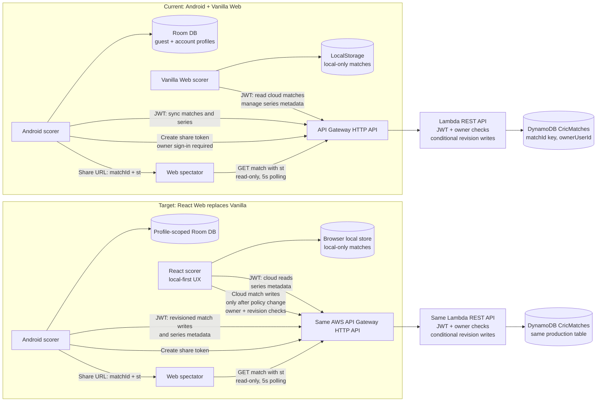

# Comprehensive Architecture, Migration & Cloud Sync Strategy Plan

## Executive Summary & Context

This document outlines the end-to-end strategy to transition the **CricketScorer** ecosystem from a single-device local scoring application into a **multi-user, cloud-synchronized platform with a modern React Web frontend**.

---

## 1. Current State vs. Target Cloud Architecture

**Target write-policy gate:** The deployed Lambda currently has `ENFORCE_ANDROID_MATCH_WRITES=true`. React can read cloud matches now, but cloud scoring writes remain blocked until an explicit scorer authorization policy is selected and deployed. Do not treat a client-supplied platform header as proof of trusted app identity.

---

## 2. Verified Current AWS Backend

The existing AWS stack is reusable, but current routes and guarantees must be distinguished from proposed React features.

### Current resources and policy
- API Gateway HTTP API invokes `aws/lambda/index.mjs`; static Web assets are served separately.
- DynamoDB `CricMatches` is on-demand and keyed only by `matchId`. It has no owner/series GSI; list APIs scan the table and filter in Lambda.
- Authentication uses `POST /auth/register` and `POST /auth/login` (no `/api` prefix), bcrypt hashes, and a JWT secret from Secrets Manager. Responses use `{ token, user: { userId, email, name } }`.
- Production sets `ENFORCE_ANDROID_MATCH_WRITES=true` and `ENFORCE_STRICT_MATCH_REVISION=false`.
- Match updates are full snapshots. Conditional writes compare the stored revision and spectator-token version; stale snapshots return `409`. This is not an append-only ball-event API.
- Spectator links use a signed token bound to a match and token version, with supported TTLs of 15, 60, or 360 minutes.

Do **not** set `ENFORCE_ANDROID_MATCH_WRITES=false` as a standalone React fix. First select the React scorer authorization model. Keep JWT owner checks and conditional revisions; a client-supplied platform header is not proof of trusted app identity. If React is authorized to score, update CORS for any new headers and test owner isolation and write conflicts before deployment.

### Existing routes
- `GET /matches`, `GET /matches/{id}`, `POST /matches`, `PUT /matches/{id}`, `DELETE /matches/{id}`
- `POST /matches/{id}/share-token`, `POST /matches/{id}/revoke-share`
- `GET /tournaments`, `POST /tournaments`, `DELETE /tournaments/{id}`
- `GET /players`, `POST /players`, `DELETE /players/{id}`

There is no current `/api/series/active/snapshot`, `/matches/{id}/balls`, `/matches/{id}/claim`, `/matches/{id}/share`, or `DELETE /matches/{id}/share` route.

---

## 3. Multi-User Data Consistency & Conflict Prevention

### A. Current Snapshot Concurrency
1. A client sends a full match payload with a top-level increasing `revision`.
2. Lambda conditionally writes only if the stored revision and spectator-token version still match the snapshot read by the handler.
3. A stale or concurrent write returns `409 STALE_REVISION`.
4. The current client must preserve the local conflict and reconcile explicitly; it must not blindly replay a ball or replace local state with the cloud snapshot.

### B. Future Multi-Scorer Event Contract
If Android and React will score the same cloud match concurrently, implement an append-only ball-event endpoint before enabling React writes. Each event needs a stable unique event ID, conditional insertion/deduplication, deterministic ordering, and an atomic match revision update. On conflict, fetch the latest snapshot and replay only events confirmed absent by ID. The current backend does not provide this route or idempotency behavior.

### C. Player Identity Across Weekly Team Changes
Use stable player IDs as identity; names are display/search fields and must not silently merge different people. Add an explicit duplicate-review and merge/alias workflow. Aggregate career statistics by canonical player ID across completed match histories. The current API has owner-scoped player records, but no unified cross-account player registry or automatic name-normalization merge.

### D. Current Offline Scoring
Android queues account-tagged full match snapshots and retries eligible operations after connectivity returns. It does not queue independently identified ball events or post to `/matches/{id}/balls`; do not claim exactly-once ball ingestion. If event-based writes are introduced, add durable event IDs and server-side deduplication before relying on retries.

---

## 4. API Contract: Current Versus Proposed

The API base is `https://cricleagueapi.nrkmart.in`; current paths have no `/api` prefix.

### Current routes
| Method and route | Behavior |
| --- | --- |
| `POST /auth/register`, `POST /auth/login` | Return `{ token, user: { userId, email, name } }`. |
| `GET /matches` | Return authenticated owner-scoped match snapshots. |
| `GET /matches/{id}` | Return an owner match, or a LIVE match when a valid spectator token is supplied as `st`. |
| `POST /matches`, `PUT /matches/{id}` | Create/update full match snapshots. Payload fields including `id` and `revision` are top-level; there is no `{ expectedRevision, match }` wrapper. Writes are owner checked and conditionally committed. |
| `DELETE /matches/{id}` | Delete an owned match. |
| `POST /matches/{id}/share-token` | Issue owner-authorized spectator JWT; body accepts `ttlMinutes` values 15, 60, or 360. |
| `POST /matches/{id}/revoke-share` | Revoke existing spectator links. |
| `GET`, `POST`, `DELETE /tournaments[/{id}]` | Owner-scoped series metadata operations. |
| `GET`, `POST`, `DELETE /players[/{id}]` | Owner-scoped player record operations. |

`POST /matches/{id}/balls`, `GET /series/active/snapshot`, and `/matches/{id}/claim` are **not implemented**. Do not wire React or Android clients to those proposed paths until backend routes and tests are added.

### Proposed future APIs
- `GET /sync/bootstrap?seriesId=...`: owner-authorized, paginated series/player/match bootstrap response. Implement with DynamoDB owner/series indexes rather than a full-table scan.
- `POST /matches/{id}/balls`: only if multi-scorer or exactly-once offline ball ingestion is required. Include a stable event ID, expected revision, transactionally deduplicate event IDs, and atomically advance the match revision. Define conflict response and replay semantics before implementation.

---

## 5. React Web Migration Roadmap (`CricketScorer/web`)

The React/Vite project already exists at `CricketScorer/web`; this is a completion and integration effort, not a new scaffold. The production Vanilla app remains at `CricketScorer-web/public/` until React parity and release gates pass.

### Verified React project status
- The project has React 19/Vite, navigation, match/tournament contexts, local repositories, a `CloudApiAdapter`, and scoring UI components.
- Scoring engines exist in multiple locations (`web/src/engine`, `web/src/domain`, and `web/src_legacy_engine`), while the Vanilla production source is `CricketScorer-web/src/engine/ScoringEngine.ts`. Compare them with golden fixtures and designate one canonical implementation; do not blindly port a duplicate.
- `AuthProvider` exists but is not mounted by the current `App.tsx`.
- `LocalAuthRepository` creates fake JWT-like strings and stores plaintext passwords in browser storage. It is test/local scaffolding, not production authentication.
- `CloudApiAdapter` currently uses `/api/...` routes, a different login response shape, a nonexistent active-snapshot endpoint, `{ expectedRevision, match }` payloads, and `/share` routes. These do not match the deployed API contract in Section 4.

| Phase | Work | Acceptance gate |
| --- | --- | --- |
| **0. Baseline and parity** | Compare React, Vanilla, and Android model/engine behavior; add golden fixtures for extras, wickets, strike changes, innings transitions, historical edits, and match completion. | Same match history yields equivalent score, player stats, and status in all clients. |
| **1. Auth and API adapter** | Mount `AuthProvider`; replace fake production auth with the existing AWS JWT contract; align routes and payloads to Section 4; configure API base by environment. | Real login/session restore, local guest use, owner isolation, and spectator read-only tests pass. |
| **2. Data repositories** | Connect match, series, and player repositories to real endpoints while retaining profile-scoped local persistence and handling partial API failure. | Android-created cloud data is visible to the same React account; other accounts cannot read it. |
| **3. Scoring UI parity** | Complete setup, toss, live scoring, extras/wickets, pending actions, innings transitions, undo/edit, scorecard, overs, and stats using the canonical engine. | Golden tests and flow-by-flow UI parity checks pass before changing the production site. |
| **4. Cloud writes and conflicts** | Keep match writes blocked until the scorer authorization policy is selected. If React scoring is enabled, use owner authorization and current full-snapshot revisions; present `409` conflicts rather than silently rebasing balls. | Two-client conflict tests prove no accepted score is lost or duplicated. |
| **5. Spectator and staged release** | Preserve the existing `matchId` + `st` URL and token lifecycle. Deploy React to a staging origin/prefix with a rollback path to Vanilla. | Auth, scoring, offline, API, and spectator acceptance gates pass before CloudFront cutover. |

For the step-by-step Gemini execution prompts, see `Doc/REACT_WEB_MIGRATION_GEMINI_PROMPT_PLAN.md`. That prompt plan is subordinate to the verified API contract above and must not treat proposed routes as implemented.

---

## 6. Deep Integration Review: Android App (`CricketScorer/app`) ↔ AWS Backend (`CricketScorer-web/aws/`)

### A. Authentication & Session Management
- **Android (`CloudSyncManager.kt`):** Calls `https://cricleagueapi.nrkmart.in/auth/login` and `/auth/register` with `HttpURLConnection` (no `/api` prefix). It stores `token`, `userId`, `email`, `name`, and API base in ordinary app-private `SharedPreferences`; these preferences are not encrypted preferences.
- **AWS Lambda (`index.mjs`):** Validates passwords using `bcryptjs`, executes deliverability DNS checks (MX/A records), and signs JWT tokens with AWS Secrets Manager secrets.

### B. Match Upsert & Queue Operations
- **Android (`CloudSyncManager.kt`):**
  - Persists pending match/series operations per account, serializes writes per match, and uses increasing full-snapshot revisions.
  - Debounces operations and retains retryable failures; it does not implement exponential backoff or idempotent ball-event ingestion.
  - Sends `X-Client-Platform: android` on match writes to satisfy the current deployment policy.
- **AWS Lambda (`index.mjs`):**
  - Validates request payload sizes (max 256 KB) and event limits (max 3,000 balls / 400 wickets).
  - Performs conditional full-snapshot writes against stored match revision and spectator-token version. The client supplies the increasing top-level `revision`; this is not a dedicated revision-increment or append-ball route.

### C. Spectator Link Generation & Token Lifecycle
- **Android (`CloudSyncManager.kt` & `WebShareApi.kt`):**
  - Requests `POST /matches/{id}/share-token` with TTL options (15, 60, 360 minutes).
  - Builds a Web URL using `matchId`, `st`, and `spectator=1` query parameters.
  - Revokes with `POST /matches/{id}/revoke-share`.
  - `WebShareApi.kt` fetches spectator snapshots from `GET /matches/{id}?st={token}` on the API host.
- **AWS Lambda (`index.mjs`):**
  - Signs spectator JWTs containing `purpose: "spectate"`, `matchId`, owner ID, and token version.
  - Checks purpose, match, expiry, token version, persisted share-active state, and LIVE status. Revoke/share changes use conditional writes to reject concurrent stale transitions.

### D. Match Ownership Claiming
- Android stores local owner claims to prevent ordinary cross-account uploads and offers explicit claiming for unowned local backups.
- There is no `/matches/{id}/claim` API. Local claims are device metadata, not a cloud ownership transfer. The Lambda assigns/validates `ownerUserId` during authenticated match creation and enforces it on later writes.

### E. Offline & Hybrid Fallback
- **Nearby P2P (`NearbyManager.kt`):** Separate Android-to-Android nearby transport over Google Nearby Connections; it does not persist to AWS by itself.
- **Cloud queue (`CloudSyncManager.kt`):** Account-tagged match and series snapshots retry when connectivity returns. A `409` stays a conflict for manual reconciliation; there is no safe auto-replay of uncommitted ball events yet.

---

## 7. React Web Current Status and Integration Gaps

The React/Vite application exists at `CricketScorer/web`. It is not yet production-integrated with the current Lambda contract. The current source includes `CloudApiAdapter.ts`, `AuthContext.tsx`, `MatchContext.tsx`, and `TournamentContext.tsx`, but:

- `App.tsx` does not mount `AuthProvider`; the React auth context does not currently govern the app.
- `repositories/index.ts` selects `LocalAuthRepository`, which fabricates JWT-like strings and stores plaintext passwords in LocalStorage. These are not valid AWS credentials and must not be used as production auth.
- `CloudApiAdapter.ts` uses `/api/...` paths, expects an auth response shape different from Lambda's `{ token, user: { userId, email, name } }`, calls nonexistent `/series/active/snapshot` and `/share` routes, and sends a `{ expectedRevision, match }` wrapper the current match endpoints do not accept.
- The Web match writer must remain disabled until an explicit scorer authorization policy is approved. A platform header sent by the browser is not trusted client authentication.
- The React engine exists in multiple directories. Compare implementations and choose one canonical engine before expanding scoring functionality; the Vanilla TypeScript engine and generated runtime should remain unchanged until parity is established.

### React integration phases
1. **Auth and contracts:** Mount auth state, remove fake production auth, align CloudApiAdapter with Section 4, and configure the API base by environment.
2. **Read-only cloud bootstrap:** Fetch owner-scoped matches, tournaments, and players using current routes; handle partial failures and pagination requirements.
3. **Scoring parity:** Reuse one canonical engine; validate match setup, toss, extras, wickets, pending actions, innings changes, undo/history edit, scorecard, and stats against golden fixtures.
4. **Optional Web cloud scoring:** Keep disabled until the writer model is explicitly chosen and authorization, revision conflict, CORS, and offline semantics are tested end to end.
5. **Staged release:** Deploy React to a staging origin/prefix, keep Vanilla rollback available, and switch production only after parity and spectator tests pass.

### Review of Gemini's Example Implementations

| Gemini example | Status in `CricketScorer/web` | Review finding |
| --- | --- | --- |
| Android `appendBallEvent()` posting to `/api/matches/{id}/balls` | **Not implemented** | Lambda has no ball-append route. The current Android/AWS contract sends full match snapshots to `/matches` or `/matches/{id}` with a top-level revision. The sketch also lacks coroutine/IO dispatch, connect/read timeouts, cancellation, and definitions for its payload/response types. Do not integrate it until the server event route and idempotency contract exist. |
| Standalone `recalculateMatchFromHistory()` sample | **Not suitable as a port** | React already has a scoring engine. The sample counts `RETIRED_HURT` as a wicket, omits `GRANTED` and several actual wicket types, and does not model strike rotation, dismissals, player/bowler stats, pending actions, innings transitions, targets, or historical edits. Reuse one canonical existing engine and compare all client implementations with golden fixtures. |
| `BallTicker.tsx` and `ScoringButtons.tsx` | **Exact components absent; related UI is inline** | `LiveScoringView.tsx` already renders recent balls and scoring controls. The sample ticker takes the last six events, not necessarily the current over when wides, no-balls, or adjustments are present. The sample controls hard-code extras and a direct BOWLED action, bypassing run-out/catch/fielder workflows; its `disabled` prop is not applied to native buttons. Use the existing engine summaries and pending-action state rather than copying these snippets. |
| React live-sync/409 recovery described as complete | **Not implemented against the live API** | The current `CloudApiAdapter` uses `/api/...`, `/series/active/snapshot`, and `/share` paths and a wrapped `{ expectedRevision, match }` payload. These differ from the deployed routes and response contract in Section 4. Its 409 handler therefore cannot provide the claimed automatic event rebase. |
| Upload React under an S3 `/v2/` prefix | **Deployment design only** | An S3 prefix alone does not guarantee SPA routing, correct asset base paths, or API CORS for that origin. Prefer a staging hostname/distribution or explicitly configure CloudFront behavior, SPA fallback, asset paths, and CORS before testing. Do not overwrite the production Vanilla root during migration. |

---

## 8. Risk Analysis & Technical Recommendations

### 1. Revision conflicts
- **Current:** The API writes full match snapshots conditionally and returns `409 STALE_REVISION`. Android retains the conflicting local snapshot and requires reconciliation; there is no ball append endpoint or server-side ball deduplication.
- **Recommendation:** Keep explicit conflict UX while full snapshots are used. Do not automatically replay balls from two competing full snapshots.
- **Future multi-scorer option:** Add a durable append-only ball-event route with unique event IDs, idempotent server insertion, deterministic ordering, and an atomic revision update. Only then can a client fetch the latest match and safely replay events whose IDs are confirmed absent.

### 2. Spectator delivery scale
- **Current:** Web spectators poll `GET /matches/{id}?st=<token>` every five seconds. The route validates spectator purpose, match ID, expiry, token version, active-share state, and LIVE status.
- **Capacity note:** API Gateway currently has a 20-request/second rate limit and burst limit 40. At five-second polling, 100 spectators alone approach 20 requests/second, before normal app traffic. Load-test and review throttles before a large event.
- **Future enhancement:** Consider API Gateway WebSockets or SSE when measured concurrency/latency needs justify connection tracking, subscribe authorization, disconnect cleanup, and revocation handling. These transports are not implemented today.

---

## 9. Match Day Operational Runbook (Zero-Issue Scoring)

1. **Pre-Match Sync (1 Minute Before Game):**
  - The Android scorer signs into the intended cloud account and runs Cloud Sync to upload owned series metadata and revisioned match snapshots.
  - The React Web client signs into the same account and reads the current owner-scoped records via `GET /matches`, `GET /tournaments`, and `GET /players`. These are separate calls; `/series/active/snapshot` is not implemented.
2. **Match Owner Initialization:**
  - Create/score through Android for cloud match state under the current Android-only match-write policy. A React local-only match stays in browser storage and is not an AWS match.
3. **Spectator Live Sharing:**
  - The signed-in Android match owner requests `POST /matches/{id}/share-token` and shares the generated Web URL with `matchId`, `st`, and `spectator=1` query parameters.
  - Spectators need no scorer account; the page fetches read-only snapshots through `GET /matches/{id}?st=...` and polls every five seconds. The owner can revoke with `POST /matches/{id}/revoke-share`.
4. **Seamless Offline Fallback:**
  - Android retains account-tagged match/series snapshot operations for retry. If a revision conflict occurs, reconcile explicitly; unique `ballUuid` event replay is not implemented.
